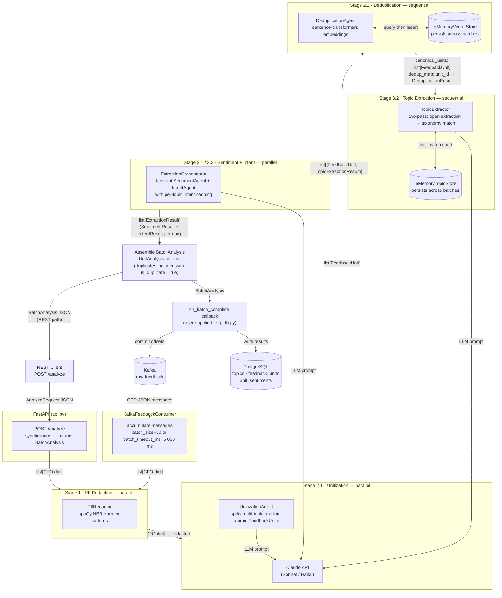

# CLAUDE.md

This file provides guidance to Claude Code (claude.ai/code) when working with code in this repository.

## Setup

```bash
pip install confluent-kafka anthropic sentence-transformers numpy spacy psycopg2-binary fastapi "uvicorn[standard]"
python -m spacy download en_core_web_trf
```

Initialize the database schema:
```bash
python -c "from db import PostgresStore; PostgresStore.from_url('postgresql://localhost/voc').apply_schema()"
```

## Running

```bash
# Start Kafka consumer (production mode)
python pipeline.py

# Start REST API (development, auto-reload)
uvicorn api:app --reload --port 8000

# Start REST API (production; workers=1 required — TopicStore and dedup index are in-memory)
uvicorn api:app --port 8000 --workers 1

# Smoke-test the DB layer
DATABASE_URL="postgresql://localhost/voc_test" python db.py
```

## Architecture

This is a **6-stage pipeline-of-agents** system that transforms raw customer feedback into structured, queryable insights using Claude as the reasoning core.

The central data object is the **Canonical Feedback Object (CFO)** — created in Stage 1, enriched by each subsequent stage.

## Data Flow

> **Keep this diagram in sync with the code.** When adding, removing, or reordering pipeline stages, update the diagram below.



### Stage modules and concurrency constraints

| File | Stage | Execution |
|---|---|---|
| `stage1_pii_redaction.py` | PII redaction via spaCy NER + regex | Parallel (CPU-bound) |
| `stage2_unitization.py` | Split multi-topic feedback into atomic units via Claude | Parallel (I/O-bound) |
| `stage2_deduplication.py` | Near-duplicate detection via embeddings (`InMemoryVectorStore`) | **Sequential** (ordering constraint) |
| `stage3_topic_extraction.py` | Two-pass topic extraction: open extraction → taxonomy match (`InMemoryTopicStore`) | **Sequential** (TopicStore not thread-safe) |
| `stage3_sentiment_extraction.py` | Polarity, intensity, emotions, sarcasm via Claude | Parallel |
| `stage3_intent_extraction.py` | Intent classification via Claude; `ExtractionOrchestrator` caches and fans out sentiment+intent | Parallel |
| `pipeline.py` | Orchestration, `PipelineConfig`, `KafkaFeedbackConsumer`, `FeedbackPipeline` | `ThreadPoolExecutor` (default 8 workers) |
| `db.py` | PostgreSQL persistence — `topics`, `feedback_units`, `unit_sentiments` tables | Idempotent via `ON CONFLICT` |

### Key thresholds

- `DUPLICATE_THRESHOLD = 0.95` — cosine similarity for near-duplicate detection
- `TOPIC_MATCH_THRESHOLD = 0.82` — embedding similarity to match existing topics
- `NEW_TOPIC_CONF_FLOOR = 0.70` — minimum LLM confidence to promote a candidate topic

### LLM model selection

- **`llm_model_complex`** (default: `claude-sonnet-4-6`) — high-judgment tasks: unitization and topic extraction. These require nuanced instruction following and calibrated label specificity.
- **`llm_model_simple`** (default: `claude-haiku-4-5-20251001`) — structured extraction: sentiment and intent. Outputs are well-defined JSON with fixed enums; Haiku handles them well at lower cost and latency.

Both are fields on `PipelineConfig`.

### Kafka semantics

At-least-once delivery — offsets are committed only after a successful DB write. The pipeline is safe to restart after a crash and will reprocess the last uncommitted batch.

## Design Reference

`feedback-analyzer-system-design.md` is the authoritative design document. It covers algorithm details, data flow examples (including a full worked example starting at line ~488), schema rationale, failure modes, and engineering trade-offs. Read it before making significant architectural changes.
